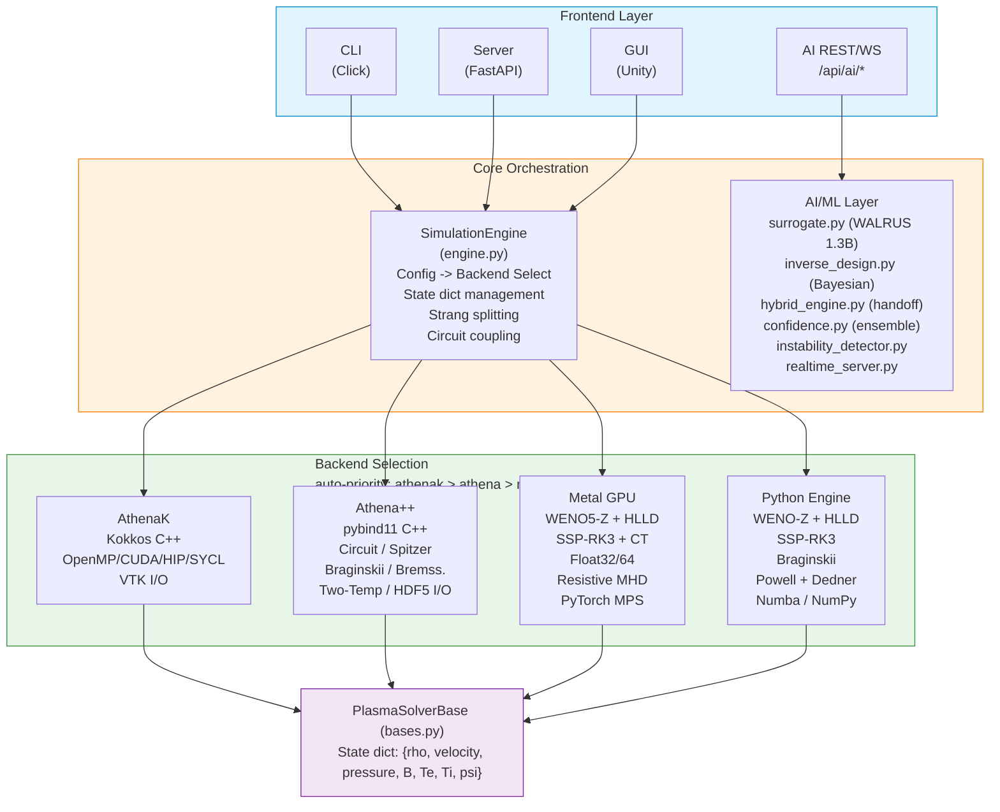
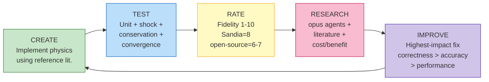
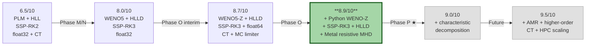
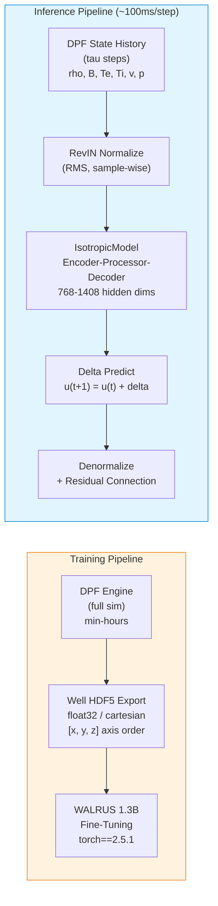
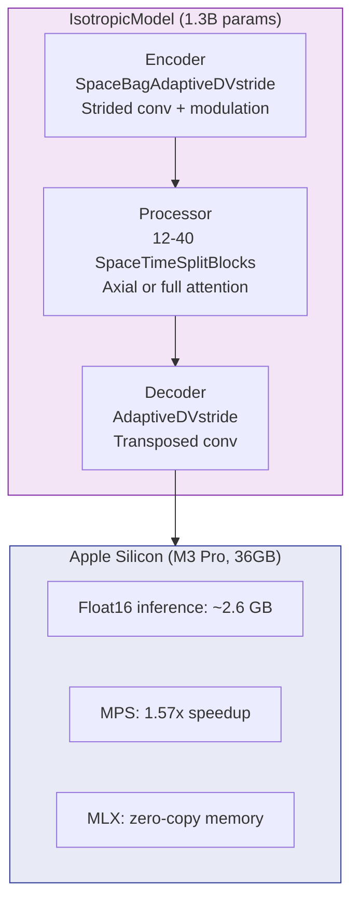
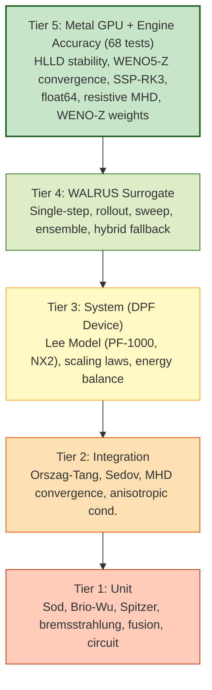
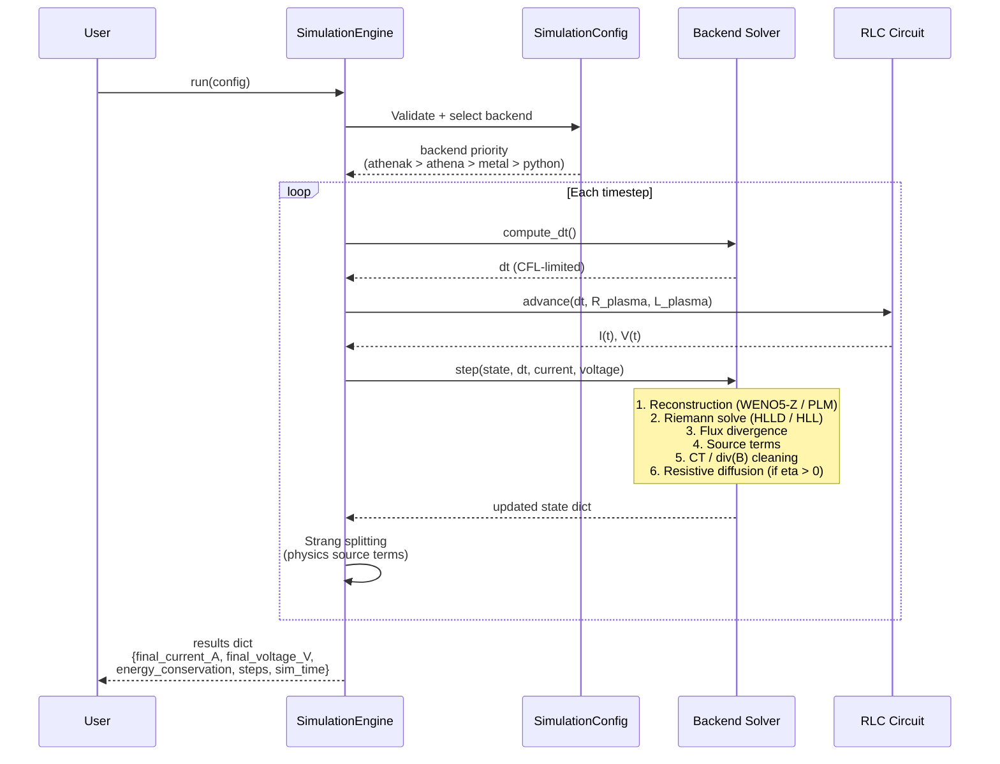

# DPF Unified — Architecture & Data Flow

## System Architecture



**Fidelity Grade: 8.9/10** | 1,475 tests (1,353 non-slow + 122 slow) | 0 failures | Phases A-P complete

---

## Metal GPU Physics Stack (Phase P — 8.9/10)

```mermaid
graph TB
    subgraph MetalSolver["MetalMHDSolver (metal_solver.py)"]
        subgraph TimeInt["Time Integration"]
            RK3["SSP-RK3<br/>3-stage, O(3)<br/>Shu-Osher 1988"]
            RK2["SSP-RK2<br/>2-stage, O(2)<br/>Gottlieb et al."]
        end

        subgraph Recon["Spatial Reconstruction (metal_riemann.py)"]
            WENO["WENO5-Z<br/>5th-order<br/>Borges 2008<br/>FD point-value<br/>tau5 indicator"]
            PLM["PLM<br/>2nd-order<br/>minmod/MC limiter"]
        end

        subgraph Riemann["Riemann Solvers (metal_riemann.py)"]
            HLLD["HLLD<br/>8-component<br/>4 intermediate states<br/>Miyoshi & Kusano 2005<br/>NaN -> HLL fallback"]
            HLL["HLL<br/>2-wave<br/>fully vectorized"]
        end

        subgraph DivB["Divergence Control"]
            CT["Constrained Transport<br/>(metal_stencil.py)<br/>div(B) = 0 to machine prec."]
        end

        subgraph Resistive["Resistive MHD (Phase P)"]
            ResMHD["Operator-Split Diffusion<br/>Explicit with CFL sub-cycling<br/>dt_diff = dx^2 * mu0 / (2*eta)<br/>Spitzer / anomalous eta"]
        end

        Precision["Precision: float32 (MPS GPU) | float64 (CPU fallback)"]
    end

    TimeInt --> Recon --> Riemann --> DivB --> Resistive --> Precision

    style MetalSolver fill:#e8f5e9,stroke:#2e7d32
    style TimeInt fill:#c8e6c9,stroke:#388e3c
    style Recon fill:#c8e6c9,stroke:#388e3c
    style Riemann fill:#c8e6c9,stroke:#388e3c
    style DivB fill:#c8e6c9,stroke:#388e3c
    style Resistive fill:#a5d6a7,stroke:#1b5e20
```



---

## Python Engine Physics Stack (Phase P — 8.9/10)

```mermaid
graph TB
    subgraph PySolver["MHDSolver / CylindricalMHDSolver (mhd_solver.py)"]
        subgraph PyTime["Time Integration"]
            PyRK3["SSP-RK3 (default)<br/>3-stage, O(3)<br/>Shu-Osher 1988"]
            PyRK2["SSP-RK2<br/>2-stage, O(2)"]
        end

        subgraph PyRecon["Flux Computation"]
            PyWENO["WENO-Z Weights<br/>Borges 2008<br/>FV Jiang-Shu polynomials<br/>Interior cells [2, N-3]"]
            PyGrad["np.gradient<br/>2nd-order central<br/>All cells (fallback)"]
        end

        subgraph PyRiemann["Riemann Solvers"]
            PyHLLD["HLLD (default)<br/>Miyoshi & Kusano 2005<br/>Full 8-component"]
            PyHLL["HLL<br/>2-wave fallback"]
        end

        subgraph PyDivB["Divergence Control"]
            Powell["Powell Source Terms"]
            Dedner["Dedner Hyperbolic Cleaning"]
        end

        subgraph PyPhysics["DPF Physics"]
            Circuit["Circuit RLC Coupling"]
            Spitzer["Spitzer Resistivity"]
            Brag["Braginskii Transport"]
            TwoTemp["Two-Temperature e/i"]
            Bremss["Bremsstrahlung"]
            Nernst["Nernst Effect"]
        end

        VelClamp["Velocity Clamping<br/>10x fast magnetosonic<br/>(WENO5 boundary safety)"]
    end

    PyTime --> PyRecon --> PyRiemann --> PyDivB --> PyPhysics --> VelClamp

    style PySolver fill:#e3f2fd,stroke:#1565c0
    style PyTime fill:#bbdefb,stroke:#1976d2
    style PyRecon fill:#bbdefb,stroke:#1976d2
    style PyRiemann fill:#bbdefb,stroke:#1976d2
    style PyDivB fill:#bbdefb,stroke:#1976d2
    style PyPhysics fill:#90caf9,stroke:#0d47a1
```



> **Note**: Python WENO-Z is a *hybrid* scheme — WENO5 flux divergence updates density/momentum
> only in interior cells `[2, N-3]`, while other terms use `np.gradient` on all cells. This
> boundary mismatch limits stability for dynamic problems with sound waves. For full-fidelity
> WENO5+HLLD+SSP-RK3, use the **Metal engine** which has a fully conservative formulation.

---

## Iterative Accuracy Workflow



### Accuracy Milestones



---

## AI/ML Data Pipeline



### WALRUS Architecture Detail



---

## Verification & Validation Tiers



---

## Backend Accuracy Comparison (Phase P)

| Feature | Python Engine | Athena++ | AthenaK | Metal GPU |
|---------|--------------|----------|---------|-----------|
| Reconstruction | WENO-Z (hybrid) | PLM/PPM | PLM/PPM | WENO5-Z (full) |
| Riemann Solver | **HLLD** (default) | HLLD/HLLC | HLLD/HLLC | **HLLD** + HLL fallback |
| Time Integration | **SSP-RK3** | VL2 | VL2 | **SSP-RK3** |
| Precision | float64 | float64 | float64 | float32/64 |
| div(B) Control | Powell + Dedner | CT | CT | CT |
| Resistive MHD | Spitzer (Strang split) | Full (C++) | Basic | **Operator-split + CFL sub-cycling** |
| DPF Physics | Full | Full (C++) | Basic | Hydro + MHD + Resistive |
| Circuit Coupling | Yes | Yes (C++) | No | No |
| Braginskii | Yes | Yes (C++) | No | No |

### Maximum Accuracy Configuration

```python
# Metal engine (recommended for highest fidelity)
MetalMHDSolver(
    reconstruction="weno5",      # 5th-order WENO-Z (Borges et al. 2008)
    riemann_solver="hlld",       # Miyoshi & Kusano (2005) 4-wave solver
    time_integrator="ssp_rk3",   # Shu-Osher (1988) 3rd-order SSP
    precision="float64",         # CPU float64 for maximum accuracy
    use_ct=True,                 # Constrained transport for div(B)=0
    limiter="mc",                # Monotonized Central slope limiter
)

# Python engine (full DPF physics, HLLD + SSP-RK3 defaults)
MHDSolver(
    gamma=5/3,
    use_weno5=False,             # np.gradient for stability on dynamic problems
    riemann_solver="hlld",       # HLLD default (Phase P)
    time_integrator="ssp_rk3",   # SSP-RK3 default (Phase P)
)
```

---

## Engine Step Flow (SimulationEngine.run)



---

## Phase History

```mermaid
gantt
    title DPF Unified Development Phases
    dateFormat X
    axisFormat %s

    section Foundation
    A - Documentation           :done, a, 0, 1
    B - Wire Physics            :done, b, 1, 2
    C - V&V Framework           :done, c, 2, 3
    D - Braginskii Transport    :done, d, 3, 4
    E - Apple Silicon           :done, e, 4, 5

    section C++ Integration
    F - Athena++ Integration    :done, f, 5, 6
    G - Athena++ DPF Physics    :done, g, 6, 7

    section AI/ML
    H - WALRUS Pipeline         :done, h, 7, 8
    I - AI Features             :done, i, 8, 9

    section Advanced Backends
    J.1 - AthenaK Integration   :done, j1, 9, 10

    section GPU & Accuracy
    M - Metal GPU               :done, m, 10, 11
    N - Cross-Backend V&V       :done, n, 11, 12
    O - Physics Accuracy        :done, o, 12, 13
    P - Engine Accuracy         :done, p, 13, 14

    section Future
    J.2+ - Backlog              :j2, 14, 15
```


