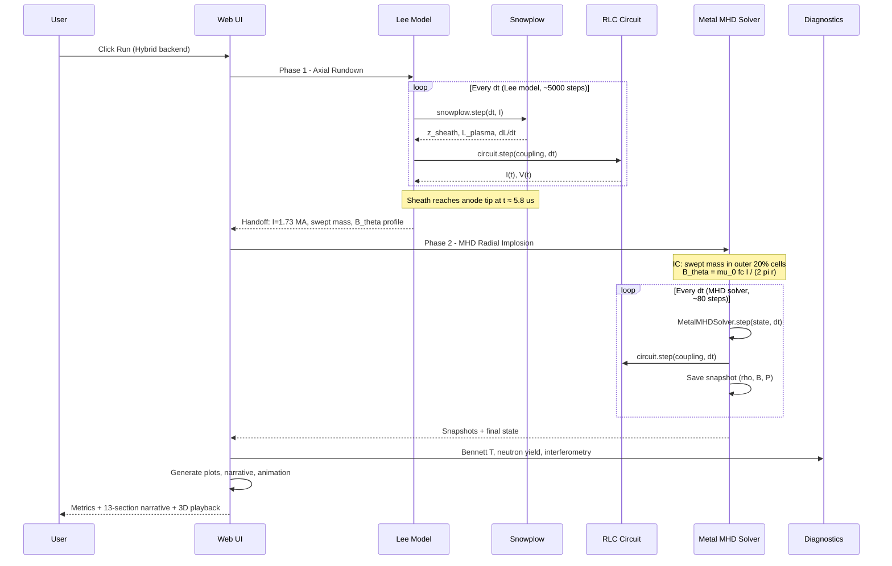

# DPF-Unified Architecture

## System Overview


```mermaid
graph TB
    subgraph UI["Web UI (Gradio @ localhost:7860)"]
        APP[app.py<br/>Main Application]
        PLOTS[app_plots.py<br/>2D Charts]
        ANIM[app_anim.py<br/>3D Animations]
        NARR[app_narrative.py<br/>Physics Narrative]
        VALID[app_validation.py<br/>Experimental Comparison]
        SWEEP[app_sweep.py<br/>Parameter Sweeps]
        COMP[app_compare.py<br/>Multi-Run Comparison]
    end

    subgraph BACKENDS["Simulation Backends (app_mhd.py)"]
        LEE[Lee Model < 1s<br/>0D Circuit + Snowplow]
        HYBRID[Hybrid 3-30s<br/>Lee rundown then MHD pinch]
        METAL_PLM[2D MHD Fast 10-60s<br/>PLM+HLL GPU float32]
        METAL_W5[2D MHD Precise 30-120s<br/>WENO5+HLLD CPU float64]
        METAL_3D[3D MHD 2-10min<br/>Cartesian GPU float32]
        ATHENA[Athena++ C++ 10-60s<br/>PPM+HLLD+CT]
    end

    subgraph CIRCUIT["Circuit (src/dpf/circuit/)"]
        RLC[rlc_solver.py<br/>RLC + Crowbar Switch]
        COUP[CouplingState<br/>Back-EMF L_p dL/dt]
    end

    subgraph FLUID["Fluid Dynamics (src/dpf/fluid/)"]
        SNOW[snowplow.py<br/>Lee Snowplow<br/>Axial + Radial + Reflected + Pinch]
        CYL[cylindrical_mhd.py<br/>2D Axisymmetric MHD<br/>np.gradient SSP-RK2/3]
    end

    subgraph METAL["Metal GPU (src/dpf/metal/)"]
        MSOL[metal_solver.py<br/>PyTorch MPS/CPU<br/>PLM/WENO5 + HLL/HLLD]
        MSTEN[metal_stencil.py<br/>Reconstruction + CT]
        MRIEM[metal_riemann.py<br/>HLL + HLLD Solvers]
    end

    subgraph DIAG["Diagnostics (src/dpf/diagnostics/)"]
        NEUT[neutron_yield.py<br/>Bosch-Hale D-D]
        PB11[pb11_yield.py<br/>Nevins-Swain p-B11]
        INST[instability.py<br/>Tearing + Plasmoids]
        INTF[interferometry.py<br/>Abel Transform]
    end

    subgraph RAD["Radiation (src/dpf/radiation/)"]
        BREM[bremsstrahlung.py]
        LINE[line_radiation.py]
    end

    subgraph PRESETS["Device Presets (src/dpf/presets.py)"]
        P1[PF-1000 1MJ]
        P2[NX2]
        P3[UNU-ICTP]
        P4[MJOLNIR 1MJ]
        P5[FAETON-I]
        P6[POSEIDON]
        P7[Tutorial]
    end

    subgraph EXTERN["External C++ (external/)"]
        ATH[athena/<br/>Princeton Athena++]
        AK[athenak/<br/>AthenaK Kokkos]
    end

    APP --> LEE & HYBRID & METAL_PLM & METAL_W5 & METAL_3D & ATHENA
    APP --> PLOTS & ANIM & NARR & VALID & SWEEP & COMP

    LEE --> RLC & SNOW
    HYBRID --> SNOW & MSOL & RLC
    METAL_PLM & METAL_W5 & METAL_3D --> MSOL & RLC
    ATHENA --> ATH & RLC
    CYL --> BREM & LINE

    MSOL --> MSTEN & MRIEM
    RLC --> COUP
    SNOW --> COUP

    LEE & HYBRID & METAL_PLM --> NEUT & INST & INTF & PB11
    VALID --> EXP[experimental.py<br/>Published Data]

    PRESETS --> LEE & HYBRID & METAL_PLM

    classDef ui fill:#1a237e,stroke:#5c6bc0,color:#fff
    classDef backend fill:#0d47a1,stroke:#42a5f5,color:#fff
    classDef physics fill:#1b5e20,stroke:#66bb6a,color:#fff
    classDef gpu fill:#e65100,stroke:#ff9800,color:#fff
    classDef diag fill:#4a148c,stroke:#ab47bc,color:#fff
    classDef ext fill:#b71c1c,stroke:#ef5350,color:#fff

    class APP,PLOTS,ANIM,NARR,VALID,SWEEP,COMP ui
    class LEE,HYBRID,METAL_PLM,METAL_W5,METAL_3D,ATHENA backend
    class RLC,COUP,SNOW,CYL physics
    class MSOL,MSTEN,MRIEM gpu
    class NEUT,PB11,INST,INTF,BREM,LINE diag
    class ATH,AK ext
```

## Hybrid Lee+MHD Data Flow


```mermaid
sequenceDiagram
    participant User
    participant UI as Web UI
    participant Lee as Lee Model
    participant Snow as Snowplow
    participant Circuit as RLC Circuit
    participant MHD as Metal MHD Solver
    participant Diag as Diagnostics

    User->>UI: Click Run (Hybrid backend)
    UI->>Lee: Phase 1 - Axial Rundown

    loop Every dt (Lee model, ~5000 steps)
        Lee->>Snow: snowplow.step(dt, I)
        Snow-->>Lee: z_sheath, L_plasma, dL/dt
        Lee->>Circuit: circuit.step(coupling, dt)
        Circuit-->>Lee: I(t), V(t)
    end

    Note over Lee,Snow: Sheath reaches anode tip at t ≈ 5.8 us

    Lee-->>UI: Handoff: I=1.73 MA, swept mass, B_theta profile

    UI->>MHD: Phase 2 - MHD Radial Implosion
    Note over MHD: IC: swept mass in outer 20% cells<br/>B_theta = mu_0 fc I / (2 pi r)

    loop Every dt (MHD solver, ~80 steps)
        MHD->>MHD: MetalMHDSolver.step(state, dt)
        MHD->>Circuit: circuit.step(coupling, dt)
        MHD->>MHD: Save snapshot (rho, B, P)
    end

    MHD-->>UI: Snapshots + final state

    UI->>Diag: Bennett T, neutron yield, interferometry
    UI->>UI: Generate plots, narrative, animation
    UI-->>User: Metrics + 13-section narrative + 3D playback
```

## Physics Equations


```mermaid
graph LR
    subgraph CIRCUIT["RLC Circuit (Kirchhoff)"]
        KVL["L dI/dt + I dL/dt + RI = V_cap"]
    end

    subgraph AXIAL["Axial Rundown (Lee Model)"]
        F1["F_mag = mu_0/4pi ln(b/a) (fc I)^2"]
        F2["m dv/dt = F_mag - p_0 A - v dm/dt"]
        F3["L_p = mu_0/2pi ln(b/a) z"]
    end

    subgraph RADIAL["Radial Implosion"]
        R1["F_rad = mu_0/4pi (fc I)^2 z_f / r_s"]
        R2["M dv_r/dt = -F_rad + p_back - v_r dM/dt"]
        R3["L_p = L_ax + mu_0/2pi z_f ln(b/r_s)"]
    end

    subgraph PINCH["Pinch Diagnostics"]
        B1["Bennett: mu_0 I^2 / 8pi = N_l kB(Te+Ti)"]
        N1["Y_n = 0.5 n^2 sigma_v V tau + Y_BT"]
        G1["tau_m0 = 31 R^2 sqrt(P) / (CR I)"]
    end

    subgraph MHD["MHD Conservation Laws"]
        M1["Mass: d_rho/dt + div(rho v) = 0"]
        M2["Momentum: d(rho v)/dt + div(flux) = J x B"]
        M3["Energy: dE/dt + div(E flux) = 0"]
        M4["Induction: dB/dt = curl(v x B - eta J)"]
    end

    CIRCUIT --> AXIAL --> RADIAL --> PINCH
    CIRCUIT --> MHD
```

## File Structure

```
dpf-unified/
├── app.py                          # Main Gradio web application
├── app_engine.py                   # Lee model simulation driver
├── app_mhd.py                      # MHD backend router + hybrid Lee+MHD
├── app_plots.py                    # 2D chart generators (waveforms, physics)
├── app_anim.py                     # 3D animated playback (Lee + MHD)
├── app_narrative.py                # Physics narrative with LaTeX + citations
├── app_validation.py               # Comparison to published experiments
├── app_sweep.py                    # Parameter sweeps with published overlays
├── app_compare.py                  # Multi-run comparison + config save/load
├── src/dpf/
│   ├── circuit/
│   │   └── rlc_solver.py           # RLC circuit with crowbar switch
│   ├── fluid/
│   │   ├── snowplow.py             # Lee snowplow (axial + radial + reflected)
│   │   └── cylindrical_mhd.py      # 2D axisymmetric MHD (NumPy)
│   ├── metal/
│   │   ├── metal_solver.py         # Metal GPU MHD solver (PyTorch)
│   │   ├── metal_stencil.py        # WENO5/PLM reconstruction
│   │   └── metal_riemann.py        # HLL/HLLD Riemann solvers
│   ├── diagnostics/
│   │   ├── neutron_yield.py        # Bosch-Hale D-D reactivity
│   │   ├── pb11_yield.py           # p-B11 aneutronic yield
│   │   ├── instability.py          # Tearing mode + plasmoid detection
│   │   └── interferometry.py       # Abel transform + fringe shifts
│   ├── radiation/
│   │   ├── bremsstrahlung.py       # Free-free radiation losses
│   │   └── line_radiation.py       # Bound-bound + recombination
│   ├── presets.py                  # 11 device presets (PF-1000, NX2, etc.)
│   ├── validation/
│   │   └── experimental.py         # Published device measurements
│   └── config.py                   # Pydantic configuration models
├── external/
│   ├── athena/                     # Princeton Athena++ C++ MHD (compiled)
│   └── athenak/                    # AthenaK Kokkos (GPU-portable)
└── tests/                          # ~3400 tests
```
