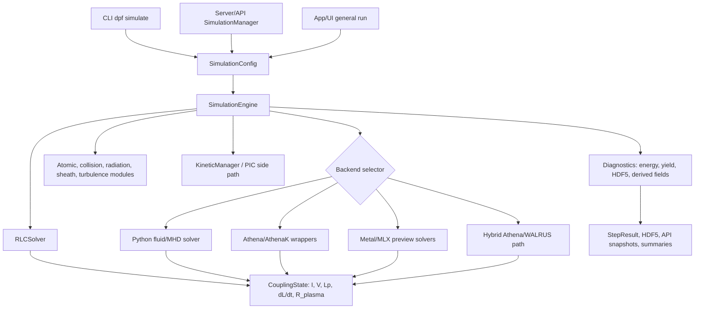
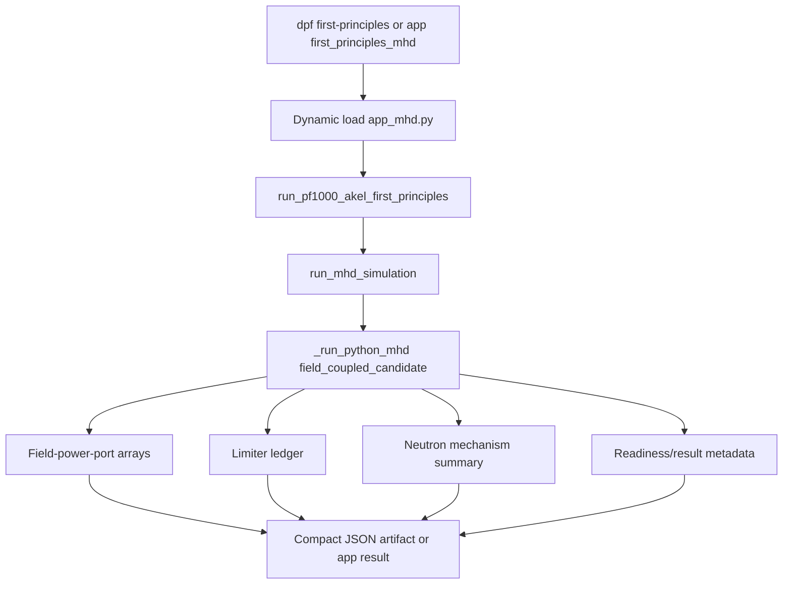
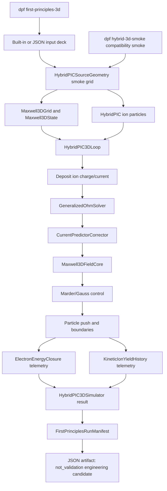
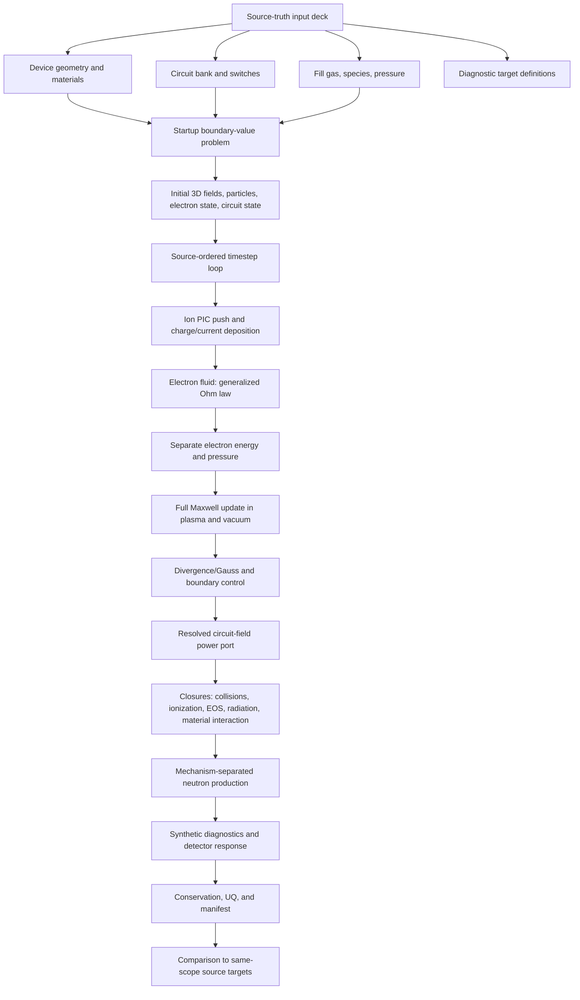
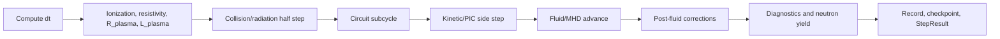
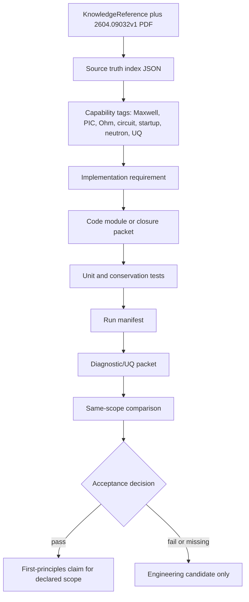
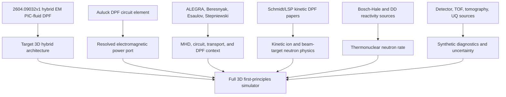
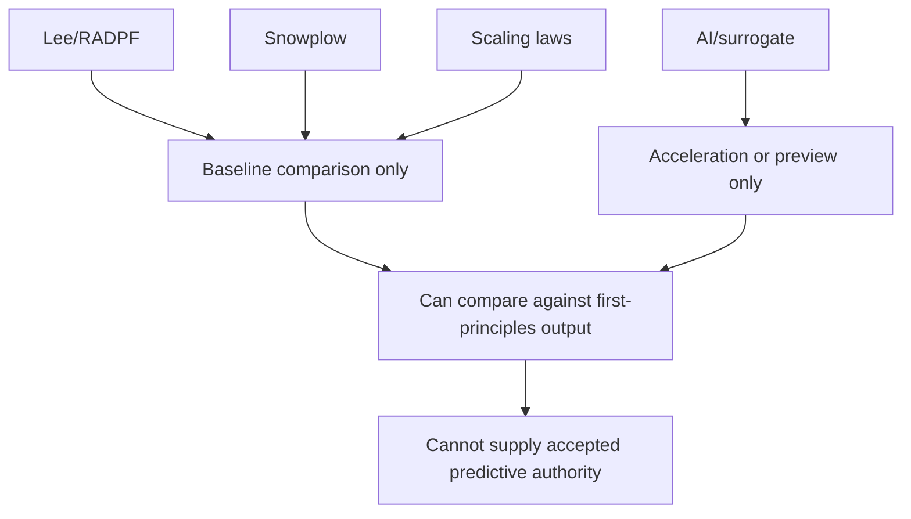
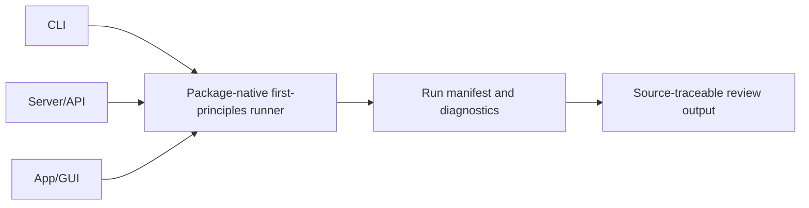

# DPF Simulation Workflow Wire Diagram

Date: 2026-05-15

This document explains the DPF-Unified simulation wiring from a first-principles
perspective. It separates the current program flow from the target full 3D
first-principles flow.

## Current Program Flow



The current ordinary path is a circuit plus MHD-oriented engine. It can run
useful physics probes, but it is not yet the complete 3D hybrid PIC-fluid
first-principles simulator.

## Current App-Backed First-Principles Branch



This branch currently carries richer first-principles telemetry than the
ordinary `StepResult` path. The target architecture should move those channels
into the package-native first-principles manifest rather than leaving them in a
repo-root app.

## Current Package-Native 3D Engineering Flow



This path has the right architectural spine, but it is still a compact
engineering candidate. It does not yet carry production geometry, startup,
resolved circuit power closure, validated electron energy, or same-scope
diagnostic targets.

`dpf first-principles-3d --deck deck.json --output run.json` is the current
package-native CLI glue for this path. Without `--deck`, it runs a minimal
built-in engineering deck; without `--output`, it prints the JSON artifact to
stdout. The older `dpf first-principles` PF-1000/Akel command remains unchanged
and app-backed.

The package-native command now routes through
`src/dpf/first_principles/runner.py`, not the older validation workflow. Its
artifact includes a source-index manifest, conservation telemetry, candidate
evidence keys, and explicit `can_support_first_principles_acceptance = false`
until a real engineer-reviewed source-backed acceptance packet exists.

## Target Full 3D First-Principles Flow



The target path removes reduced-model authority from the predictive chain. Lee,
snowplow, scaling-law, and surrogate outputs may remain comparison or preview
layers, but they cannot drive the accepted first-principles result.

## Target Timestep Loop

```mermaid
flowchart LR
    A[State n: E, B, particles, ne, Te, circuit] --> B[Advance ion positions/velocities]
    B --> C[Apply conductor/PML/particle boundaries]
    C --> D[Deposit charge and ion current]
    D --> E[Rebuild quasi-neutral electron density]
    E --> F[Solve generalized Ohm law]
    F --> G[Predict/correct total current]
    G --> H[Advance Maxwell fields]
    H --> I[Apply Gauss/divergence control]
    I --> J[Update electron energy and closures]
    J --> K[Update circuit through Poynting or J.E power port]
    K --> L[Accumulate diagnostics, UQ, conservation residuals]
    L --> M[State n+1]
```



Current `SimulationEngine.step()` order for the general path is different:



The general path is useful, but the target loop must make field, particle,
electron, and circuit state co-equal rather than side-loading kinetic and
field-power behavior around a fluid-centered step.

Required residual ledgers per step:

- charge conservation and Gauss-law residual;
- magnetic divergence residual;
- field energy, particle kinetic energy, electron internal energy, circuit
  energy, radiation loss, boundary work, and total residual;
- current deposition and predictor-corrector residual;
- limiter/floor/cap/repair activation count;
- neutron mechanism increments and detector-response increments.

## Source-Truth To Code Traceability



The index is not itself a validation certificate. It is the map that prevents
coding from drifting away from the source-truth corpus.

## First-Principles Source Spine



The strongest corpus result is that we have a credible source spine for the
architecture. The weakest parts are not the high-level concept; they are
startup/electrodes, exact 3D circuit-field boundary closure, separate electron
energy, radiation/material coupling, beam-target detector response, and a
single same-scope validation packet.

## Reduced-Model Boundary



Reduced models remain valuable for regression, speed, intuition, and comparison.
They must not be used as closure factors inside the accepted first-principles
chain.

## Final Workflow Contract

The final simulator should expose one package-native contract:

```text
FirstPrinciplesInputDeck
  -> StartupBoundaryValueProblem
  -> HybridEMPicFluidRun
  -> FirstPrinciplesRunManifest
  -> DiagnosticAndUQPacket
  -> SameScopeComparisonPacket
```

All user surfaces should call this same contract:


